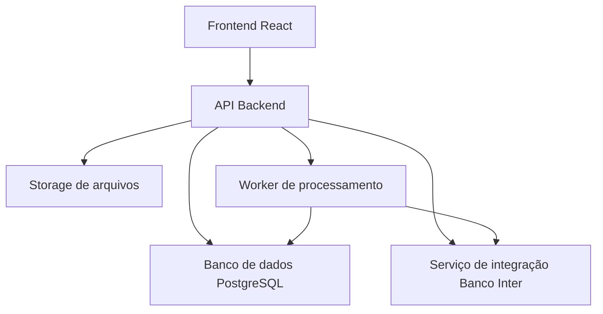
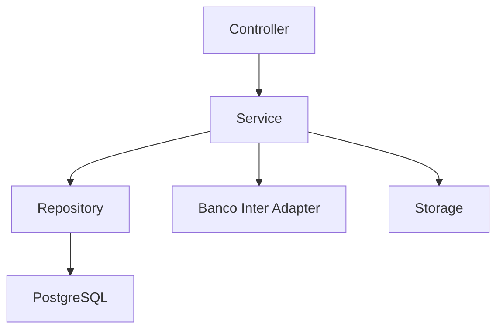
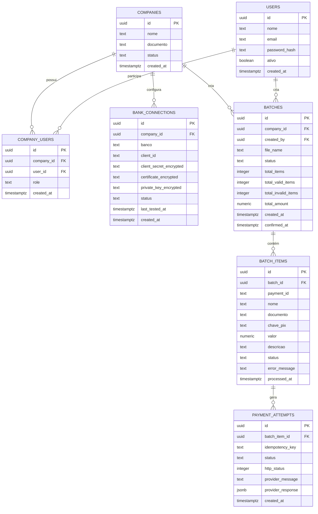

## 1. Desenho Da Arquitetura


## 2. Descrição De Tecnologia
- Frontend: React 18 + Vite + Tailwind CSS 3
- Backend: Python 3.12 + Flask
- Banco de dados: PostgreSQL
- Storage: Supabase Storage ou S3 compatível
- Fila inicial: execução síncrona controlada no MVP 1, com evolução para worker assíncrono
- Integração externa: API PIX do Banco Inter com autenticação por credenciais e certificados
- Inicialização do frontend: Vite

## 3. Definição De Rotas
| Rota | Finalidade |
|-------|---------|
| /login | Login do usuário |
| /cadastro | Criação da empresa e usuário administrador |
| /app | Painel inicial da empresa |
| /app/conexao-bancaria | Configuração e teste da integração Banco Inter |
| /app/pagamentos/novo | Criação de pagamento unitário |
| /app/lotes/novo | Upload de planilha e criação de lote |
| /app/lotes/:id/previa | Revisão do lote antes da confirmação |
| /app/lotes/:id/resultado | Resultado do lote executado |
| /app/lotes | Histórico de lotes |
| /app/pagamentos | Histórico de pagamentos |

## 4. Definições De API
```ts
type Empresa = {
  id: string;
  nome: string;
  documento: string;
  status: "ativa" | "inativa";
  createdAt: string;
};

type Usuario = {
  id: string;
  nome: string;
  email: string;
  role: "admin" | "operador";
  empresaId: string;
  ativo: boolean;
};

type ConexaoBancaria = {
  id: string;
  empresaId: string;
  banco: "inter";
  status: "pendente" | "validada" | "erro";
  ultimoTesteEm?: string;
};

type Lote = {
  id: string;
  empresaId: string;
  status: "rascunho" | "validado" | "confirmado" | "processando" | "concluido" | "falhou";
  arquivoNome: string;
  totalItens: number;
  totalValidos: number;
  totalInvalidos: number;
  valorTotal: number;
  createdBy: string;
};

type ItemLote = {
  id: string;
  loteId: string;
  idPagamento: string;
  nome: string;
  documento: string;
  chavePix: string;
  valor: number;
  descricao?: string;
  status: "pendente" | "valido" | "invalido" | "sucesso" | "falha";
  erro?: string;
};
```

### Endpoints Principais
| Método | Endpoint | Finalidade |
|--------|----------|------------|
| POST | /api/auth/register-company | Cria empresa e usuário administrador |
| POST | /api/auth/login | Autentica usuário |
| GET | /api/me | Retorna contexto autenticado |
| POST | /api/bank-connections/inter | Salva conexão bancária da empresa |
| POST | /api/bank-connections/inter/test | Testa credenciais e certificados |
| POST | /api/payments/single | Executa pagamento PIX unitário |
| POST | /api/batches | Faz upload da planilha e cria o lote |
| GET | /api/batches/:id | Retorna dados do lote |
| POST | /api/batches/:id/confirm | Confirma e dispara execução do lote |
| GET | /api/batches/:id/result | Retorna resultado consolidado do lote |
| GET | /api/batches | Lista lotes da empresa |
| POST | /api/batches/:id/retry-item | Reexecuta manualmente um item com falha |

## 5. Arquitetura Do Servidor


## 6. Modelo De Dados
### 6.1 Modelo Entidade Relacionamento


### 6.2 Linguagem De Definição De Dados
```sql
create table companies (
  id uuid primary key,
  nome text not null,
  documento text not null,
  status text not null default 'ativa',
  created_at timestamptz not null default now()
);

create table users (
  id uuid primary key,
  nome text not null,
  email text not null unique,
  password_hash text not null,
  ativo boolean not null default true,
  created_at timestamptz not null default now()
);

create table company_users (
  id uuid primary key,
  company_id uuid not null references companies(id),
  user_id uuid not null references users(id),
  role text not null check (role in ('admin', 'operador')),
  created_at timestamptz not null default now(),
  unique (company_id, user_id)
);

create table bank_connections (
  id uuid primary key,
  company_id uuid not null references companies(id),
  banco text not null check (banco in ('inter')),
  client_id text not null,
  client_secret_encrypted text not null,
  certificate_encrypted text not null,
  private_key_encrypted text not null,
  status text not null default 'pendente',
  last_tested_at timestamptz,
  created_at timestamptz not null default now()
);

create unique index ux_bank_connections_company_bank
  on bank_connections(company_id, banco);

create table batches (
  id uuid primary key,
  company_id uuid not null references companies(id),
  created_by uuid not null references users(id),
  file_name text not null,
  status text not null default 'rascunho',
  total_items integer not null default 0,
  total_valid_items integer not null default 0,
  total_invalid_items integer not null default 0,
  total_amount numeric(18,2) not null default 0,
  created_at timestamptz not null default now(),
  confirmed_at timestamptz
);

create index ix_batches_company_created_at
  on batches(company_id, created_at desc);

create table batch_items (
  id uuid primary key,
  batch_id uuid not null references batches(id) on delete cascade,
  payment_id text not null,
  nome text not null,
  documento text not null,
  chave_pix text not null,
  valor numeric(18,2) not null,
  descricao text,
  status text not null default 'pendente',
  error_message text,
  processed_at timestamptz
);

create index ix_batch_items_batch_id
  on batch_items(batch_id);

create table payment_attempts (
  id uuid primary key,
  batch_item_id uuid not null references batch_items(id) on delete cascade,
  idempotency_key text not null,
  status text not null,
  http_status integer,
  provider_message text,
  provider_response jsonb,
  created_at timestamptz not null default now()
);

create index ix_payment_attempts_batch_item_id
  on payment_attempts(batch_item_id);
```
