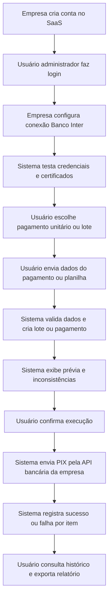

## 1. Visão Geral Do Produto
Plataforma SaaS multiempresa para automação de pagamentos via PIX, com execução diretamente na conta bancária da própria empresa cliente.
- Resolve a operação manual de pagamentos unitários e em lote, com validação, revisão, execução e histórico centralizados.
- Gera valor para empresas que precisam escalar pagamentos sem virar instituição financeira nem custodiar recursos.

## 2. Funcionalidades Centrais

### 2.1 Papéis De Usuário
| Papel | Forma de acesso | Permissões centrais |
|------|------------------|---------------------|
| Administrador da empresa | Cadastro por e-mail e senha | Gerenciar empresa, usuários, conexão bancária, pagamentos e lotes |
| Operador | Convite interno da empresa | Criar pagamentos, subir planilhas, revisar lotes e acompanhar resultados |

### 2.2 Módulos Funcionais
1. **Acesso e empresa**: cadastro da empresa, login, contexto multiempresa e sessão do usuário.
2. **Conexão bancária**: cadastro e teste da integração da conta Banco Inter Empresas da empresa via credenciais e certificados.
3. **Pagamento unitário**: formulário para executar um PIX individual com resultado imediato.
4. **Pagamentos em lote**: upload de planilha, parsing, validação, geração de lote e prévia.
5. **Execução e resultados**: confirmação da operação, envio dos PIX e visualização de sucesso ou falha por item.
6. **Histórico**: listagem de lotes e pagamentos executados, com filtros básicos e exportação CSV.

### 2.3 Detalhamento Das Páginas
| Nome da página | Módulo | Descrição funcional |
|-----------|-------------|---------------------|
| Acesso | Cadastro e login | Permite criar empresa inicial, criar usuário administrador e autenticar usuários existentes |
| Painel inicial | Resumo operacional | Exibe atalhos para pagamentos unitários, upload de lote, histórico e status da conexão bancária |
| Conexão bancária | Configuração Inter | Permite cadastrar `client_id`, `client_secret`, certificado, chave privada e testar a conexão |
| Novo pagamento | PIX unitário | Permite informar chave PIX, valor, descrição e executar um pagamento individual |
| Novo lote | Upload e validação | Permite subir CSV/XLSX, validar colunas e gerar lote em estado de revisão |
| Prévia do lote | Revisão | Exibe quantidade de itens válidos, inválidos, valor total e erros por linha antes da confirmação |
| Resultado do lote | Execução | Exibe status por pagamento, mensagem de erro, resumo do lote e opção de exportação |
| Histórico | Consulta | Lista lotes e pagamentos já executados pela empresa com busca e filtros básicos |

## 3. Fluxos Centrais
O usuário administrador cria a empresa e acessa o SaaS. Em seguida, configura a conexão da conta Banco Inter Empresas da própria empresa. Depois disso, pode executar um PIX unitário ou subir uma planilha para criar um lote. O sistema valida os dados, mostra uma prévia, solicita confirmação e então executa os pagamentos usando a API bancária da empresa conectada. Os resultados ficam registrados por empresa, com histórico, erros e possibilidade de nova tentativa manual.

## 4. Design Da Interface
### 4.1 Estilo Visual
- Cores primárias: azul petróleo, grafite profundo e verde de confirmação.
- Cores secundárias: cinza claro, vermelho de erro e âmbar para estado de atenção.
- Botões: cantos arredondados, preenchimento forte para ações primárias e contorno sóbrio para ações secundárias.
- Tipografia: fonte de título com personalidade corporativa e fonte de leitura neutra, com foco em legibilidade operacional.
- Layout: desktop-first, com navegação lateral e áreas principais em cartões de operação.
- Ícones: estilo linear limpo, com destaque claro para sucesso, erro, processamento e revisão.

### 4.2 Visão Das Páginas
| Nome da página | Módulo | Elementos de interface |
|-----------|-------------|-------------|
| Acesso | Cadastro e login | Formulários compactos, destaque para proposta do produto e estados claros de erro |
| Painel inicial | Resumo operacional | Cartões com atalhos, status da conexão e últimas execuções |
| Conexão bancária | Configuração Inter | Formulário seguro, máscaras de campo, upload de certificado e feedback de teste |
| Novo pagamento | PIX unitário | Campos objetivos, revisão resumida e retorno imediato |
| Novo lote | Upload e validação | Área de upload, orientação do template, tabela de erros e resumo do lote |
| Prévia do lote | Revisão | KPIs, tabela de linhas inválidas e CTA de confirmação |
| Resultado do lote | Execução | Status por item, totalizadores e exportação CSV |
| Histórico | Consulta | Tabela filtrável com status, datas e acesso ao detalhe do lote |

### 4.3 Responsividade
- Estratégia desktop-first, com adaptação para tablet e uso mínimo em mobile.
- Interfaces críticas de lote priorizam tabelas legíveis, resumo fixo e ações claras.
- Componentes de upload e revisão mantêm acessibilidade por teclado e mensagens explícitas.
